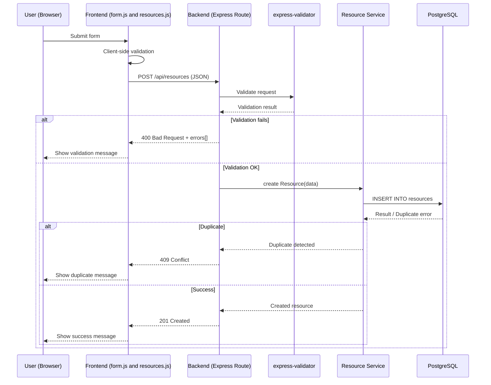
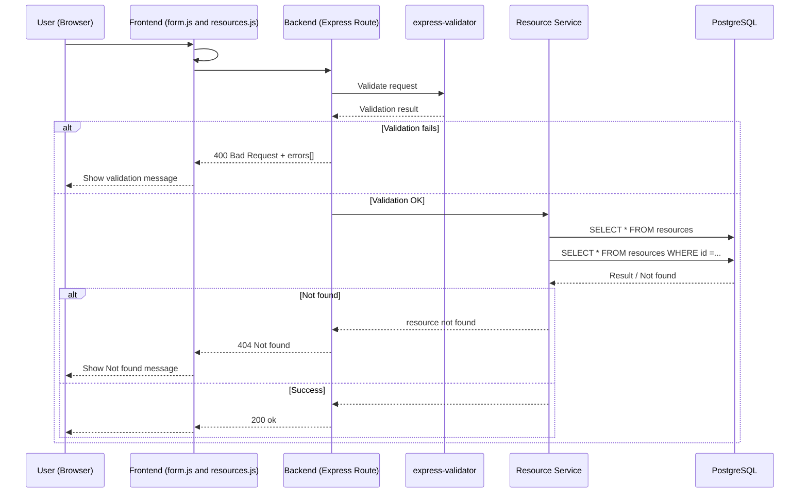
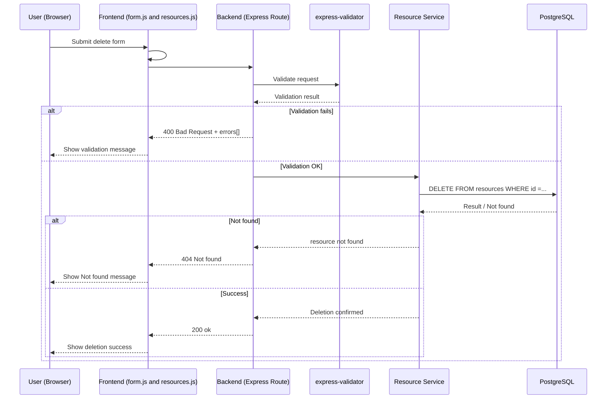

# 1️⃣ CREATE – Resource (Sequence Diagram)



# 2️⃣ READ — Resource (Sequence Diagram)



# 3️⃣ UPDATE — Resource (Sequence Diagram)

```mermaid
sequenceDiagram
    participant U as User (Browser)
    participant F as Frontend (form.js and resources.js)
    participant B as Backend (Express Route)
    participant V as express-validator
    participant S as Resource Service
    participant DB as PostgreSQL

    U->>F: Submit update form
    F->>F: Client-side validation
    F->>B: POST /api/resources (JSON)

    B->>V: Validate request
    V-->>B: Validation result

    alt Validation fails
        B-->>F: 400 Bad Request + errors[]
        F-->>U: Show validation message
    else Validation OK
        B->>S: 
        S->>DB: UPDATE resources SET ...
        DB-->>S: Result / Duplicate error / Not found

        alt Duplicate
            S-->>B: Duplicate detected
            B-->>F: 409 Conflict
            F-->>U: Show duplicate message
        alt Not found
            S-->>B: resource not found
            B-->>F: 404 Not found
            F-->>U: Show Not found message    
        else Success
            S-->>B: Updated resource
            B-->>F: 200 ok
            F-->>U: Show success message
        end
    end
```

# 4️⃣ DELETE — Resource (Sequence Diagram)

